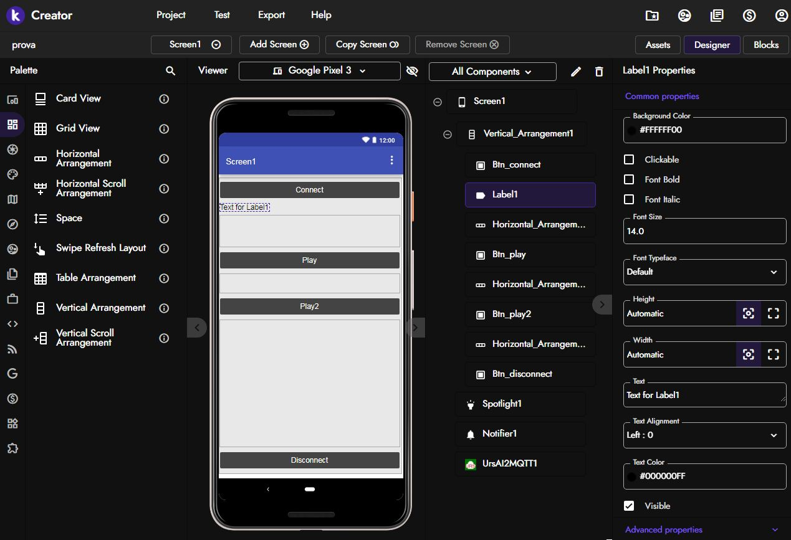
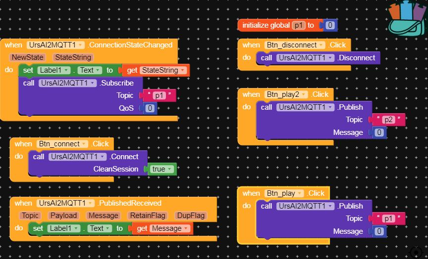

# OpenLedRace-ESP32

Control by your smartphone a led strip in ESP32 by MQTT protocol.

Kodular APP:

Tutorial MQTT ESP32 - Kodular app : http://shahrulnizam.com/kodular-lesson-mqtt-client/
Tutorial MQTT ESP32 Arduino IDE: https://randomnerdtutorials.com/esp32-mqtt-publish-subscribe-arduino-ide/

